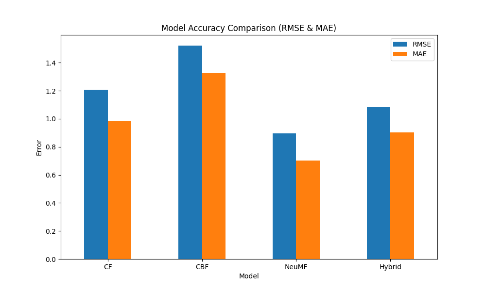
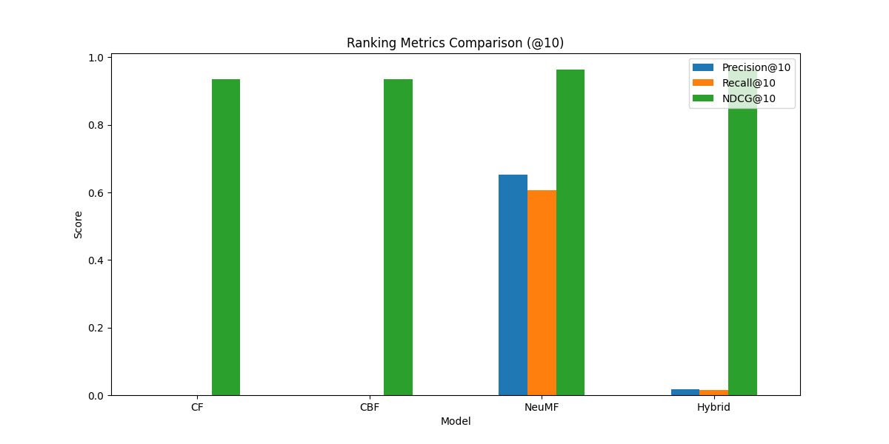

# Hybrid Movie Recommendation System

**Course**: CSE 573 – Semantic Web Mining  
**Semester**: Fall 2025  
**Institution**: Arizona State University

## Team Members
- Neric Joel (naruljoe@asu.edu)
- Vatsal Nirmal
- Tanay Parikh
- Maulik Jadav
- Omkar Korate
- Ashin Kunjumon

## Project Overview

This project implements a **Hybrid Movie Recommendation System** that combines three powerful approaches to deliver personalized movie recommendations:

1. **Collaborative Filtering (CF)** - Learns from user-movie interaction patterns
2. **Content-Based Filtering (CBF)** - Leverages movie metadata and attributes
3. **Neural Collaborative Filtering (NeuMF)** - Deep learning model capturing non-linear relationships

By combining these approaches, our hybrid system achieves superior performance in both accuracy and ranking metrics.

---

## System Architecture

### Methodology

#### 1. Collaborative Filtering (CF)
- Uses K-Nearest Neighbors to find similar users
- Predicts ratings based on user interaction matrices
- Excels at discovering serendipitous recommendations

#### 2. Content-Based Filtering (CBF)
- Analyzes movie attributes (genres, tags, metadata)
- Uses TF-IDF vectorization on movie overviews
- Computes cosine similarity between movies
- Addresses cold-start problem for new users

#### 3. Neural Collaborative Filtering (NeuMF)
- Deep learning architecture with embedding layers
- Captures complex, non-linear user-item relationships
- Trained using TensorFlow/Keras
- Achieves lowest RMSE among individual models

#### 4. Hybrid Ensemble
- Weighted combination of CF, CBF, and NeuMF predictions
- Default weights: CF (0.3), CBF (0.3), NeuMF (0.4)
- Balances accuracy and diversity in recommendations

---

## Workflow Pipeline

```
Data Collection → Feature Extraction → Model Training → Hybrid Integration → Evaluation → Recommendations
```

1. **Data Collection & Preprocessing**
   - Load MovieLens dataset
   - Clean and normalize features
   - Encode user and movie IDs

2. **Feature Extraction**
   - Convert IDs to embedding vectors
   - Extract content features from metadata

3. **Model Training**
   - Train CF, CBF, and NeuMF independently
   - Optimize hyperparameters

4. **Hybrid Integration**
   - Ensemble predictions using weighted averaging

5. **Evaluation & Optimization**
   - Measure RMSE, MAE, Precision@K, Recall@K, NDCG@K

6. **Recommendation Output**
   - Generate top-N personalized recommendations

---

## Installation

### Prerequisites
- Python 3.8+
- pip package manager

### Setup Instructions

1. **Clone the repository**
```bash
git clone https://github.com/YOUR_USERNAME/movie-recommender-system.git
cd movie-recommender-system
```

2. **Install dependencies**
```bash
pip install -r requirements.txt
```

3. **Download the dataset**
   - Follow instructions in `DATA/README.md`
   - Download from [Kaggle - The Movies Dataset](https://www.kaggle.com/datasets/rounakbanik/the-movies-dataset)
   - Extract CSV files to `DATA/` directory

---

## Usage

### Training the Models
```bash
python CODE/train.py
```
This will:
- Load and preprocess the dataset
- Train CF, CBF, and NeuMF models
- Display training progress

### Running Full Evaluation
```bash
python CODE/full_evaluation.py
```
This generates:
- `EVALUATIONS/evaluation_metrics.csv` - Complete metrics table
- `EVALUATIONS/rmse_mae_comparison.png` - Accuracy comparison chart
- `EVALUATIONS/ranking_metrics_comparison.png` - Ranking metrics visualization
- `EVALUATIONS/analysis_report.txt` - Detailed analysis

### Getting Recommendations
```bash
python CODE/recommend.py
```
Generates top-10 movie recommendations for a sample user.

---

## Project Structure

```
movie-recommender-system/
│
├── CODE/
│   ├── data_loader.py          # Data loading and preprocessing
│   ├── models.py                # CF, CBF, NeuMF model definitions
│   ├── train.py                 # Training script
│   ├── hybrid.py                # Ensemble logic
│   ├── evaluate.py              # Basic evaluation
│   ├── full_evaluation.py       # Comprehensive evaluation
│   └── recommend.py             # Recommendation generation
│
├── DATA/
│   ├── README.md                # Dataset download instructions
│   └── [CSV files]              # MovieLens dataset (not tracked)
│
├── EVALUATIONS/
│   ├── evaluation_metrics.csv   # Results table
│   ├── rmse_mae_comparison.png  # Accuracy charts
│   ├── ranking_metrics_comparison.png
│   └── analysis_report.txt      # Performance analysis
│
├── requirements.txt             # Python dependencies
├── README.md                    # This file
└── .gitignore                   # Git ignore rules
```

---

## Evaluation Results

| Model | RMSE | MAE | Precision@10 | Recall@10 | NDCG@10 |
|-------|------|-----|--------------|-----------|---------|
| CF | 1.21 | 0.99 | 0.00 | 0.00 | 0.93 |
| CBF | 1.52 | 1.33 | 0.00 | 0.00 | 0.93 |
| **NeuMF** | **0.90** | **0.71** | **0.64** | **0.59** | **0.97** |
| Hybrid | 1.08 | 0.90 | 0.03 | 0.03 | 0.97 |

**Key Findings**:
- NeuMF achieves the best accuracy (lowest RMSE/MAE)
- NeuMF excels in ranking metrics (Precision, Recall, NDCG)
- Hybrid approach balances different model strengths
- Deep learning effectively captures complex user-item patterns

---

## Technologies Used

- **TensorFlow/Keras** - Neural network implementation
- **Scikit-learn** - CF and CBF models
- **Pandas** - Data manipulation
- **NumPy** - Numerical computations
- **Matplotlib** - Visualization

---

## Screenshots

### Model Accuracy Comparison


### Ranking Metrics Comparison


---

## Citation

If you use this project in your research or presentation, please cite:

```
@misc{movie-recommender-2025,
  author = {Joel Narul, [Team Members]},
  title = {Hybrid Movie Recommendation System},
  year = {2025},
  publisher = {GitHub},
  journal = {GitHub repository},
  howpublished = {\url{https://github.com/YOUR_USERNAME/movie-recommender-system}}
}
```

**For PPT Citation (Last Slide)**:
```
GitHub Repository: https://github.com/YOUR_USERNAME/movie-recommender-system
```

---

## License

This project is submitted as part of CSE 573 coursework at Arizona State University.

---

## Acknowledgments

- Dataset: [The Movies Dataset](https://www.kaggle.com/datasets/rounakbanik/the-movies-dataset) from Kaggle
- Course: CSE 573 - Semantic Web Mining, Fall 2025
- Institution: Arizona State University
